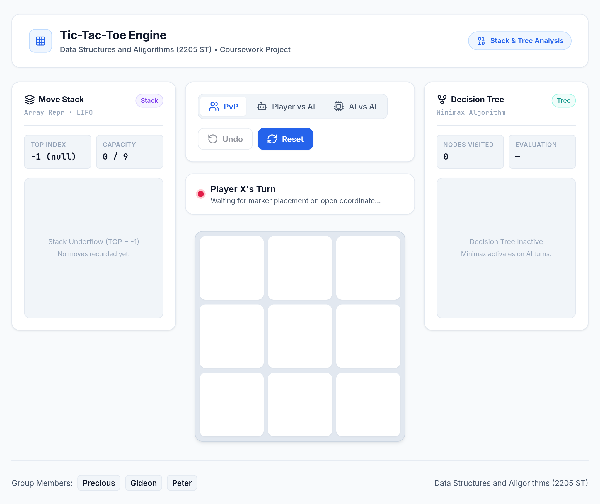

# Tic-Tac-Toe

A web-based Tic-Tac-Toe game built to demonstrate core Data Structures and Algorithms concepts, including Stacks (LIFO), Queues (FIFO), and Decision Trees (Minimax AI).

Coursework Project for **Data Structures and Algorithms (2205 ST)**.

---

## Preview



The application features a 3-panel workspace:
- **Move Stack (Left):** Real-time visual display of move history using an array-based stack.
- **Game Board (Center):** Interactive 3x3 grid with status indicators and match controls.
- **Decision Tree (Right):** Live Minimax evaluation and branch inspection during AI turns.

---

## Features

- **Game Modes:**
  - **PvP (Player vs Player):** Local two-player mode with alternating turns.
  - **Player vs AI:** Play as X or O against an unbeatable Minimax algorithm.
  - **AI vs AI:** Watch two AI engines compete against each other.
- **Undo Move:** Roll back previous moves using the stack's `POP` operation.
- **Real-Time Telemetry:** Live tracking of stack capacity, `TOP` pointer, visited tree nodes, and move scores.
- **Responsive Layout:** Clean desktop and mobile layout with no external UI framework dependencies.

---

## Data Structures & Algorithms

### 1. Stack (LIFO)
- Implemented in `scripts/stack.js` using a fixed-capacity linear array (`MAX = 9`).
- Tracks move history to enable single-step and dual-step `Undo` functionality.
- Tracks the `TOP` index with underflow (`TOP = -1`) and overflow (`TOP = MAX - 1`) boundary handling.

### 2. Queue (FIFO)
- Implemented in `scripts/queue.js` for fair, sequential turn scheduling.
- Advances active players using queue rotation (`enqueue` / `dequeue`).

### 3. Minimax Decision Tree
- Implemented in `scripts/minimax.js` using recursive Depth-First Search (DFS) and backtracking.
- Calculates the optimal move by exploring open board states and evaluating terminal outcomes.

---

## Project Structure

```plaintext
tiktaktoe/
├── index.html              # Main HTML markup
├── README.md               # Project documentation
├── images/
│   └── tiktaktoe_picture.png
├── scripts/
│   ├── main.js             # Application entry point
│   ├── game.js             # Core game engine logic
│   ├── stack.js            # Stack data structure
│   ├── queue.js            # Queue data structure
│   ├── minimax.js          # Minimax algorithm & evaluation
│   ├── panels.js           # Visual panel renderers
│   └── ui.js               # UI controls and DOM interactions
└── styles/
    ├── base.css            # Colors, fonts, and base reset
    ├── layout.css          # Grid and responsive layout
    ├── components.css      # Control cards, stats, and panels
    ├── board.css           # 3x3 game board styling
    └── animations.css      # Micro-interactions and transitions
```

---

## How to Run

No build step or dependencies required.

1. Clone or download the repository.
2. Open `index.html` in any web browser, or serve locally:

```bash
python3 -m http.server 8000
```

Open `http://localhost:8000` in your browser.

---

## Authors

**Data Structures and Algorithms (2205 ST)**

- Precious
- Gideon
- Peter
